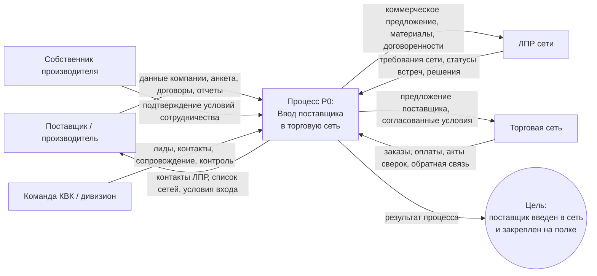
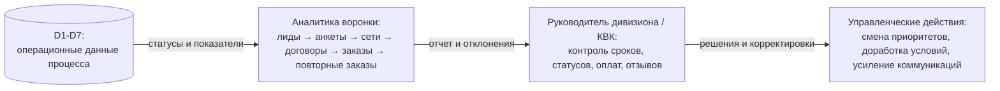

# DFD-диаграмма процесса "Ввод поставщика в торговую сеть"

Источник: `ВВС2.csv`, процесс "Гант Дивизиона Ввод в сеть".

Документ оформлен по требованиям к DFD- и процессным схемам:

- диаграммы структурированы, пронумерованы и имеют понятные названия;
- иерархия процесса показана по уровням: контекст, логика процесса, контроль;
- для процессов используются прямоугольники, для целей - круги, для точек выбора - ромбы;
- на стрелках подписаны входы и выходы процесса;
- отдельно показаны роли, хранилища данных и изменение состояния базы поставщиков.

## 1. Условные обозначения

| Элемент | Обозначение | Назначение |
| --- | --- | --- |
| Внешняя сущность | прямоугольник | участник процесса, который передает или получает данные |
| Процесс | прямоугольник | действие, преобразующее входные данные в выходные |
| Хранилище данных | хранилище | база, реестр, журнал, набор документов |
| Цель | круг | итоговый результат процесса |
| Точка выбора | ромб | развилка, альтернатива, решение о переходе |
| Поток данных | стрелка | что именно передается между сущностями, процессами и хранилищами |

## 2. Контекстная DFD, уровень 0

**Рисунок 1. Контекстная DFD процесса "Ввод поставщика в торговую сеть"**

### Потоки данных уровня 0

| Откуда | Куда | Поток данных |
| --- | --- | --- |
| Поставщик | P0 | данные о компании, анкета, подписанные договоры, отчеты по оплате |
| Собственник производителя | P0 | подтверждение условий, решения по сотрудничеству |
| КВК | P0 | лиды, база контактов, сопровождение, управленческий контроль |
| P0 | Поставщик | список сетей, цена входа, комиссии, контакты ЛПР |
| P0 | ЛПР сети / сеть | предложение поставщика, материалы, условия работы |
| Сеть | P0 | заказ, договор, оплата, обратная связь |

## 3. DFD, уровень 1

**Рисунок 2. DFD уровня 1: этапы процесса, хранилища данных и состояние базы**

```mermaid
flowchart LR
    Supplier[Поставщик / производитель]
    Owner[Собственник производителя]
    Network[Торговая сеть]
    DecisionMaker[ЛПР сети]
    KVK[Команда КВК / дивизион]

    D1[(D1: База лидов КВК)]
    D2[(D2: Анкета и оценка потенциала)]
    D3[(D3: Договоры и ДС)]
    D4[(D4: Список сетей и контакты ЛПР)]
    D5[(D5: Журнал коммуникаций)]
    D6[(D6: Заказы, оплаты, акты сверок)]
    D7[(D7: Отзывы и обратная связь)]

    S1[Состояние базы:<br/>потенциальный поставщик]
    S2[Состояние базы:<br/>поставщик с заполненной анкетой]
    S3[Состояние базы:<br/>квалифицированный поставщик]
    S4[Состояние базы:<br/>согласованы сети и условия]
    S5[Состояние базы:<br/>оформлена договорная база]
    S6[Состояние базы:<br/>поставщик в переговорах с сетью]
    S7[Состояние базы:<br/>первый заказ и контроль оплаты]
    S8[Состояние базы:<br/>активный сетевой поставщик]

    P1[P1: Собрать информацию<br/>и провести лидогенерацию]
    P2[P2: Провести анкетирование<br/>и оценить поставщика]
    P3[P3: Согласовать сети<br/>и условия входа]
    P4[P4: Оформить договоры<br/>и дополнительные соглашения]
    P5[P5: Передать контакты<br/>ЛПР сети]
    P6[P6: Сопровождать коммуникации<br/>с сетью]
    P7[P7: Контролировать заказ<br/>и оплату]
    P8[P8: Закрепить поставщика<br/>на полке]

    Choice{Есть договор<br/>или заказ?}
    Goal((Цель:<br/>повторный, третий<br/>и N-заказ))

    KVK -->|ЦЗС, рассылки, Telegram/SMM, выставки| P1
    P1 -->|лид поставщика| D1
    D1 -->|карточка лида| S1
    S1 -->|исходные данные| P2

    Supplier -->|данные о компании, текущая работа с сетями| P2
    P2 -->|анкета и первичная оценка| D2
    D2 -->|результат квалификации| S2
    S2 -->|оценка потенциала| P3

    Supplier -->|желаемые сети, категория товара, условия| P3
    Owner -->|подтверждение условий| P3
    P3 -->|согласованный список сетей| D4
    P3 -->|комиссии КВК, цена входа, условия| Supplier
    D4 -->|сети и контакты ЛПР| S3
    S3 -->|согласованные сети| P4

    P4 -->|договоры и ДС на рассмотрение| Supplier
    Supplier -->|подписанные договоры и ДС| P4
    P4 -->|оформленный комплект документов| D3
    D3 -->|договорная база| S4
    S4 -->|основание для передачи контактов| P5

    D4 -->|контакты ЛПР| P5
    P5 -->|контакты ЛПР сети| Supplier
    P5 -->|поставщик готов к переговорам| S5
    S5 -->|контакты и материалы| P6

    Supplier -->|коммуникации с сетью, статус переговоров| P6
    DecisionMaker -->|требования, ответы, статус встречи| P6
    P6 -->|еженедельный контакт, conference call 1 раз в месяц| D5
    P6 -->|предложение поставщика, материалы, договоренности| Network
    Network -->|договор или заказ| Choice
    Choice -->|нет| P6
    Choice -->|да| P7

    P7 -->|заказ, оплаты, акты сверок| D6
    P7 -->|запрос отчета до 5 числа, контроль оплаты до 10 числа| Supplier
    Supplier -->|отчеты оплат, акты сверок| P7
    D6 -->|статус заказа и оплаты| S7
    S7 -->|факт первого заказа| P8

    P8 -->|повторный, третий и N-заказ| Network
    Network -->|обратная связь по Prod1 / Prod2 / Prod3 / ProdN| P8
    P8 -->|отзывы клиента| D7
    D7 -->|результаты закрепления| S8
    S8 -->|финальный результат| Goal
```

## 4. Хранилища данных

| Код | Хранилище | Что содержит |
| --- | --- | --- |
| D1 | База лидов КВК | поставщики из ЦЗС, рассылок, Telegram/SMM, выставок |
| D2 | Анкета и оценка потенциала | анкета поставщика, первичная оценка, категория товара, анализ текущей работы с сетями |
| D3 | Договоры и ДС | договоры, дополнительные соглашения, согласованные условия |
| D4 | Список сетей и контакты ЛПР | согласованный список торговых сетей и контакты лиц, принимающих решения |
| D5 | Журнал коммуникаций | еженедельные контакты, ежемесячные conference call, статусы переговоров |
| D6 | Заказы, оплаты, акты сверок | заказ, отчеты оплат, акты сверок между поставщиком и сетью |
| D7 | Отзывы и обратная связь | отзывы по продуктам и результаты закрепления на полке |

## 5. Реестр этапов процесса

| № | Этап | Вход | Выход | Ответственная роль |
| --- | --- | --- | --- | --- |
| 1 | Собрать информацию и провести лидогенерацию | каналы поиска поставщиков | лид поставщика | КВК |
| 2 | Провести анкетирование и оценить поставщика | лид, данные компании | анкета, первичная оценка | КВК + поставщик |
| 3 | Согласовать сети и условия входа | анкета, категория, пожелания по сетям | список сетей, комиссии, цена входа | КВК + собственник |
| 4 | Оформить договоры и ДС | согласованные условия | подписанные договоры и ДС | КВК + поставщик |
| 5 | Передать контакты ЛПР сети | договорная база, список сетей | контакты ЛПР | КВК |
| 6 | Сопровождать коммуникации с сетью | контакты ЛПР, материалы | статус переговоров | поставщик + КВК |
| 7 | Контролировать заказ и оплату | договор или заказ сети | статус оплаты, акты сверок | КВК + поставщик |
| 8 | Закрепить поставщика на полке | первый заказ, обратная связь | повторные заказы, отзывы | КВК + поставщик + сеть |

## 6. Изменение состояния базы поставщиков

| Шаг | Состояние базы |
| --- | --- |
| После P1 | потенциальный поставщик |
| После P2 | поставщик с заполненной анкетой |
| После P3 | квалифицированный поставщик с согласованными сетями |
| После P4 | поставщик с оформленной договорной базой |
| После P6 | поставщик в активных переговорах с сетью |
| После P7 | поставщик с первым заказом и контролем оплаты |
| После P8 | активный сетевой поставщик |

## 7. Контур контроля, аналитики и руководства

**Рисунок 3. Контур управленческого контроля процесса**

## 8. BPMN-представление

DFD показывает прежде всего потоки данных. Для визуализации роли исполнителей, логики маршрута и точек выбора процесс можно дополнительно читать как BPMN:

- дорожка `КВК`: поиск поставщика, квалификация, согласование сетей, контроль договора и оплаты;
- дорожка `Поставщик`: анкета, подписание документов, переговоры с сетью, передача отчетов;
- дорожка `Сеть / ЛПР`: требования, решение по работе, заказ, обратная связь;
- точки выбора: `условия приняты?`, `есть договор или заказ?`;
- финальный результат: `повторный, третий и N-заказ`, подтверждающий закрепление на полке.

## 9. Проверка соответствия описанию

| Требование | Как учтено |
| --- | --- |
| 5.1 | диаграммы пронумерованы и имеют названия |
| 5.2 | уровни и логика переходов показаны слева направо |
| 5.3 | описание поддержано таблицами и короткими подписями |
| 5.4 | использованы DFD и BPMN-представление |
| 5.5 | процессы - прямоугольники, цель - круг, выбор - ромб |
| 5.6 | для этапов указаны названия, входы, выходы и роли |
| 5.7 | сверху указан процесс, ниже - этапы, затем роли и состояния базы |
| 5.8 | отражено изменение состояния базы поставщиков |
| 5.9 | этапы названы как действия, состояния базы - как состояние поставщика |
| 5.10 | отдельно вынесен контур контроля, аналитики и руководства |
